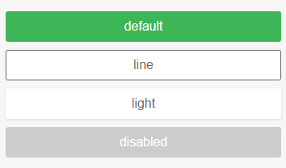

按钮，提供了各种类型、样子、状态。 

#### 示例

- 按钮类型

  默认类型为 `button`，还可设置为 `submit` 用于表单中

  ```
  <ly-button>Button</ly-button>
  <ly-button type="submit">Submit Button</ly-button>
  ```

- 按钮状态

  默认正常，可设置禁用状态

  ```
  <ly-button :disabled="true">Disabled Button</ly-button>
  ```

- 样式

  可以通过设置 `mode` 属性来改变按钮样式

  ```
  <ly-button :mode ="light">Light Button</ly-button>
  <ly-button :mode ="line">Light Button</ly-button>
  ```




#### Props 配置

| 参数                 | 说明     | 类型    | 可选值        | 默认值    |
| :------------------- | :------- | :------ | :------------ | :-------- |
| type                 | 按钮类型 | String  | button/submit | button    |
| disabled             | 禁用状态 | Boolean | true/false    | false     |
| mode                 | 按钮样式 | String  | light/line    | ""        |
| bgColor              | 背景色   | String  | “#666”等      | "#3db657" |
| border、color、width | 内联样式 | String  | css代码       | “”        |

#### 事件

| 事件名 | 说明                                         | 参数 |
| :----- | :------------------------------------------- | :--- |
| click  | 点击按钮后触发此事件，如果禁用状态，则不触发 |      |