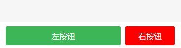

底部按钮，直接fixed在底部，传入按钮数组控制。 

#### 示例

```
<ly-footer-button :btnList="btnList"></ly-footer-button>
```

```
btnList: [
        {
          type: "button",
          value: "左按钮",
          fn: this.f1,
          disabled: false
        },
        {
          type: "button",
          bgColor: "red",
          value: "右按钮",
          fn: this.f2,
          width: "2rem"
        }
]
```




#### Props 配置

| 参数                                                        | 说明     | 类型  | 可选值 | 默认值 |
| :---------------------------------------------------------- | :------- | :---- | :----- | :----- |
| btnList(必传)                                               | 按钮列表 | Array | []     |        |
| 数组中对象值可传button的所有值，fn为回调函数，value为按钮值 |          |       |        |        |

#### 事件

| 事件名 | 说明                                         | 参数 |
| :----- | :------------------------------------------- | :--- |
| fn     | 点击按钮后触发此事件，如果禁用状态，则不触发 |      |

