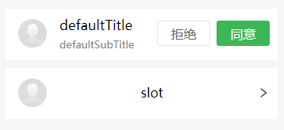

头像列表组件

#### 示例

```
<ly-list-item
      defaultTitle="defaultTitle"
      defaultSubTitle="defaultSubTitle"
      :showBtn="true"
>
</ly-list-item>
```

```
<ly-list-item 
      :showArrowType="true" 
      style="margin-top: 0.2rem"
>slot</ly-list-item>
```




#### Props 配置

| 参数            | 说明         | 类型    | 可选值     | 默认值   |
| :-------------- | :----------- | :------ | :--------- | :------- |
| item            | 循环对象数据 | Object  |            | {}       |
| defaultImg      | 头像         | String  |            | 默认头像 |
| imgCircle       | 圆形头像     | Boolean | true/false | true     |
| lazyLoad        | 头像懒加载   | Boolean | true/false | false    |
| defaultTitle    | 默认标题     | String  |            | 无       |
| defaultSubTitle | 默认副标题   | String  |            | 无       |
| showArrowType   | 右箭头       | Boolean | true/false | false    |
| showBtn         | 显示按钮     | Boolean | true/false | false    |

#### 事件

| 事件名    | 说明         | 参数                     |
| :-------- | :----------- | :----------------------- |
| clickItem | 点击整个区域 | item                     |
| clickBtn  | 点击按钮     | item,status 0 拒绝 1同意 |

