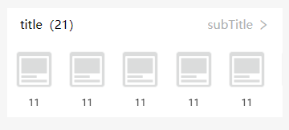

头部加滑动列表组件

#### 示例

```
<ly-swiper-box title="title" :list="list" :num="21" subTitle="subTitle" @loadMore="f1"></ly-swiper-box>
```



滑动区域为slot


#### Props 配置

| 参数          | 说明                   | 类型    | 可选值        | 默认值    |
| :------------ | :--------------------- | :------ | :------------ | :-------- |
| list          | 滑动区数据             | Array   |               | []        |
| swiperOption  | swiper的选项，参照官方 | Object  |               |           |
| num           | 数量，有值才显示       | 未限制  | String,Number | ""        |
| title         | 默认标题               | String  |               | 无        |
| subTitle      | 默认副标题             | String  |               | 无        |
| subTitleColor | 默认副标题字体颜色     | String  | css代码       | "#b1b2b3" |
| showArrow     | 显示右箭头             | Boolean | true/false    | true      |

- `list` 子配置项

| 参数 | 说明 | 类型   | 可选值 | 默认值 |
| :--- | :--- | :----- | :----- | :----- |
| img  | 图片 | String |        |        |
| name | 文字 | String |        |        |

#### 事件

| 事件名        | 说明             | 参数        |
| :------------ | :--------------- | :---------- |
| clickTitle    | 点击头部区域     |             |
| clickSubTitle | 点击副标题       |             |
| clickItem     | 点击列表中的单个 | item, index |

