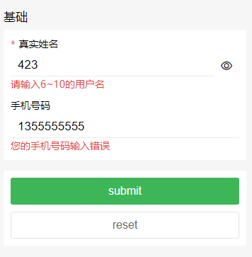

 输入框组件。支持使用`v-model`对数据双向绑定，支持一键清空内容。 

#### 示例



```
<ly-form @formSubmit="formSubmit" :formList="formList" :model=model></ly-form>
```


```
	  model: {
        username: '',
        phone: ''
      },
      formList: [
        {
          legend: "基础",
          fields: [
            {
              label: 'input',
              title: "真实姓名",
              id: "name",
              modelKey: "username",
              value: "",
              maxlength: 15,
              type: "text",
              disabled: false,
              required: true,
              rules: [
                { required: true, message: "请输入用户名" },
                { min: 6, max: 10, message: "请输入6~10的用户名" }
              ],
              showEye: {
                open: true,
                reverse: false
              },
              clearable: {
                visible: true,
                blurHidden: true
              }
            },
            {
              label: 'input',
              title: "手机号码",
              id: "phone",
              modelKey: "phone",
              value: "",
              maxlength: 11,
              type: "tel",
              disabled: false,
              rules: [
                { required: true, message: "您的手机号码未输入" },
                {
                  pattern: /^1[3456789]\d{9}$/,
                  message: "您的手机号码输入错误"
                }
              ]
            }
          ]
        },
        {
          fields: [
            {
              label: 'button',
              type: 'submit',
              value: 'submit'
              // fn: this.f1
            },
            {
              label: 'button',
              type: 'reset',
              value: 'reset',
              mode: 'line'
            }
          ]
        }
      ],
```


#### Props 配置

| 参数           | 说明           | 类型   | 可选值 | 默认值 |
| :------------- | :------------- | :----- | :----- | :----- |
| formList(必传) | 表单数据列表   | Array  |        | []     |
| model          | 双向绑定值列表 | Object |        | {}     |

- `formList` 子配置项

  数组每个对象对应一个区域

| 参数   | 说明                   | 类型   | 可选值 | 默认值 |
| :----- | :--------------------- | :----- | :----- | :----- |
| legend | 区域标题               | String |        |        |
| fields | 每个区域的表单数据列表 | Array  |        |        |

- `formList中fields` 配置项

| 参数                            | 说明               | 类型   | 可选值        | 默认值 |
| :------------------------------ | :----------------- | :----- | :------------ | :----- |
| label                           | 标签名             | String | input、button | {}     |
| modelKey                        | 用于双向绑定的键值 | String |               |        |
| value                           | 双向绑定的默认值   | String |               |        |
| 其余配置项参考对应label的配置项 |                    |        |               |        |

**默认双向绑定的是fields中的value值，如果传了model，则model中的属性的值会自动获取formList-fields中配置的相同modelKey的值**

#### 事件

| 事件名     | 说明                               | 参数 |
| :--------- | :--------------------------------- | :--- |
| formSubmit | 先校验规则，通过则触发提交表单事件 |      |

